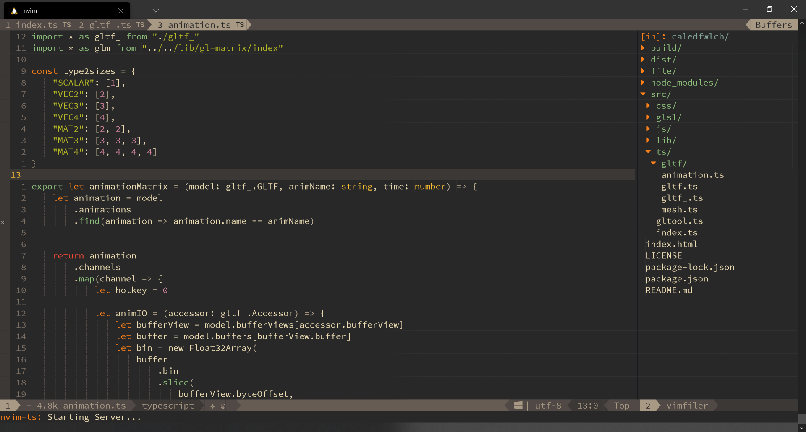
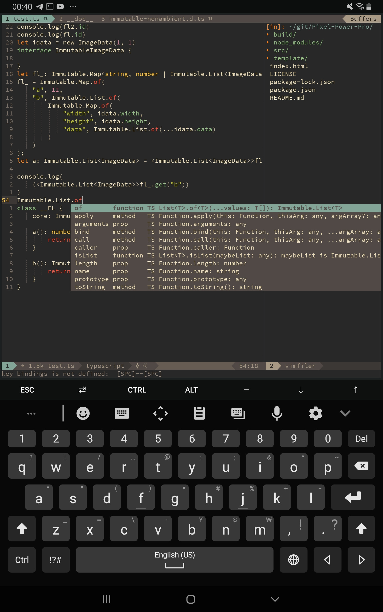

# [目錄](../../../../README.md) >> [實務篇](../../../README.md) >> [工具](../../README.md) >> [SpaceVim](../README.md) >> SpaceVim 安裝筆記（以 TypeScript 環境為例）

> 本篇文章將會講解 SpaceVim 的安裝步驟

---

# SpaceVim 安裝筆記（以 TypeScript 環境為例）

## 一. Windows Subsystem for Linux



### 安裝 SpaceVim

更新套件管理庫
```bash
sudo apt update&&upgrade
```
安裝 Python 與 Node.js
```bash
sudo apt install python
sudo apt install python-pip
sudo apt install python3
sudo apt install python3-pip
sudo apt install nodejs
```
更新 Node.js
```bash
sudo npm cache clean -f
sudo npm install -g n
sudo n stable
```
更新 npm
```bash
sudo npm i -g npm
```
安裝 neovim
```bash
sudo apt install neovim
```
更新 neovim
```bash
sudo apt-get install software-properties-common
sudo add-apt-repository ppa:neovim-ppa/unstable
sudo apt update
sudo apt install -y neovim
```
安裝 SpaceVim
```bash
curl -sLf https://spacevim.org/install.sh | bash
```
當安裝完成後執行
```bash
nvim # 第一次執行會選擇風格，可選2比較潮
nvim # 第二次執行會自動安裝插件
nvim # 第三次正式開始
```
此外，為使插件安裝後能順利執行，還需用 pip 與 npm 安裝 neovim
```bash
pip install neovim
pip3 install neovim
sudo npm i -g neovim
```
若出現部分字體無法顯示的問題，可由安裝 nerd font 字體解決(在此提供 [Sauce Code Pro Nerd Font](https://github.com/ryanoasis/nerd-fonts/raw/master/patched-fonts/SourceCodePro/Regular/complete/Sauce%20Code%20Pro%20Nerd%20Font%20Complete.ttf))，安裝完後將終端機的字體設定為"SauceCodePro Nerd Font"即可顯示完整字體。

### 設定 SpaceVim
執行`nvim`進入 SpaceVim

依序按下<kbd>SPC</kbd> <kbd>f</kbd> <kbd>v</kbd> <kbd>d</kbd>開啟 SpaceVim 設定檔( ~/.SpaceVim.d/init.toml)
```toml
[options] # 於 options 加入以下的設定
    # 使用 deoplete 作為自動補全引擎
    autocomplete_method = "deoplete"
    # 使用 ale 作為程式碼檢測工具
    enable_neomake = false
    enable_ale = true
    
[[layers]] # 增加格式化模組
    name = "format"
```

### 特定語言支持
安裝 language-server-protocol
```toml
[[layers]] # 增加 language-server-protocol 模組
    name = "lsp"
    filetypes = [ # 要支持的語言
        ...language
    ]
```

#### TypeScript
```toml
[[layers]]
    name = "lang#typescript"
```
另外需安裝 TypeScript
```bash
npm i -g typescript
```
安裝 TypeScript Language Server
```bash
npm install -g typescript-language-server
```

#### JavaScript
```toml
[[layers]]
    name = "lang#javascript"
```
另外可安裝 eslint-cli 與 js-beautify 完成語法檢查與代碼格式化
```bash
npm i -g eslint-cli
npm i -g js-beautify
```
安裝 JavaScript Language Server
```bash
npm install -g javascript-typescript-langserver
```
## 二. Termux


#### 詳見 [Termux 安裝與設定](../../termux/termux安裝與設定/README.md)
